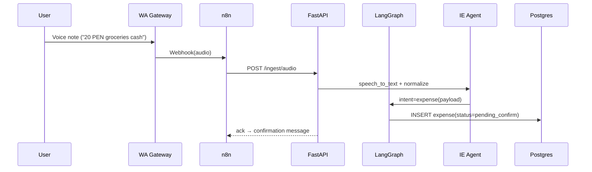
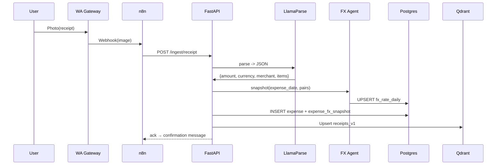
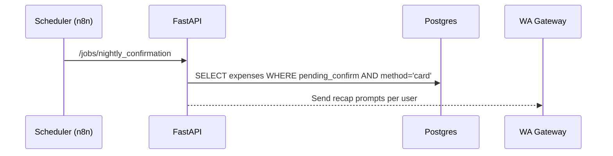

# Context Document — Personal Finance Travel Assistant (MVP)

> **Status**: Draft v1
> **Target runtime**: Python 3.13
> **Owners**: Harrison (Product/Tech), Collaborators (TBD)

## 1) Executive Summary

A WhatsApp‑first personal finance assistant focused on **Travel Mode**. Users capture expenses via **text, voice, or images** (receipts). The system freezes **daily FX rates** at the time of the expense, supports **multiple cards and accounts**, manages **budgets by category and trip**, and provides **coaching** using SQL analytics and RAG over receipts/policies.

The MVP emphasizes: reliable intake, currency normalization, nightly confirmations for card charges, and clear reporting. Architecture is modular to enable future modes (Saving, Investing) and multi‑agent orchestration.

## 2) Problem Statement & Goals

**Problem**: Travelers lack a unified, low‑friction flow to log expenses in real time across countries/currencies, reconcile card charges, and understand budget adherence.

**Primary Goals**

* Capture expenses from WhatsApp (text/voice/image) with minimal friction.
* Normalize to **home currency** using **frozen FX snapshots** tied to `occurred_at`.
* Support **multiple users/cards/accounts** with defaults and confirmations.
* Provide **budget tracking** by trip/category and **conversational insights** (Q&A).
* Keep costs low; start with a single‑VM Docker Compose deployment.

**Non‑Goals for MVP**

* Automated bank statement ingestion or deep anomaly detection.
* Sophisticated financial planning; focus on short‑term travel budgeting.

## 3) Users, Modes & Key Use Cases

**Primary User**: Individual/couple traveling abroad (e.g., Colombia → Ecuador → Peru) seeking near real‑time visibility of spend.

**Mode**: **Travel Mode** (future: Saving Mode, Investing Mode).

**Top Use Cases**

1. Log an expense from **voice** (“20 soles, groceries, cash”).
2. Upload a **receipt image**, parse merchant/items/total, and persist.
3. **Set country** and Travel Mode → system preloads required FX pairs.
4. **End‑of‑day confirmation** for card expenses (actual posted amount & fees).
5. Ask: “How much did we spend on food in Lima (PEN/COP/USD)?”
6. Track **budget vs actual** per category (Food, Lodging, Transport, Tourism).

## 4) Business Logic (Authoritative Summary)

* **Expense intake** produces a normalized record with `amount_original`, `currency_original`, `occurred_at`, `category`, `method` (cash/card), `account_id` and optional `card_id`.
* **FX snapshot** computed at expense date; store immutable totals in `expense_fx_snapshot` (to `home_currency`, USD, and local currency as needed).
* **Cards**: If a card is implied but not specified, prompt the user; use **default** if no response within a configured window. Nightly confirmation reconciles real posted amounts/fees.
* **Budgets**: Trip‑scoped; category allocations, alerts, and split rules (per participant) live in `budget.rules`.
* **RAG**: Receipts (parsed text) and policies/FAQs indexed into Qdrant for semantic queries.

## 5) System Overview

```mermaid
graph TB
  subgraph Client
    WA[WhatsApp User(s)]
  end

  subgraph Ingestion
    GW[WhatsApp Gateway]
    N8N[n8n Orchestrator]
  end

  subgraph App & Agents
    API[FastAPI]
    LG[LangGraph Orchestrator]
    A1[IE Agent]
    A2[FX Agent]
    A3[Card Agent]
    A4[Coach Agent]
  end

  subgraph Data
    PG[(PostgreSQL)]
    QD[(Qdrant)]
    OBJ[(Object Storage)]
    RED[(Redis)]
  end

  subgraph External
    OCR[LlamaParse/OCR]
    FX[FX Provider]
  end

  WA-->GW-->N8N-->API
  API<-->LG
  LG-->A1-->OCR
  LG-->A2-->FX
  LG-->A3
  LG-->A4
  API-->PG
  API-->QD
  API-->OBJ
  API-->RED
```

## 6) Data Architecture (Relational & Vector)

**Relational (Postgres)** — key tables:

* `user`, `account`, `card`, `trip`, `category`, `budget`, `expense`, `expense_fx_snapshot`, `fx_rate_daily`, `receipt`, `notification_event`.
  **Principles**: immutable FX snapshot per expense date; idempotent ingestion (message/receipt hash); strict FKs; indexes on `occurred_at`, `trip_id`, `category_id`, `card_id`.

**Vector (Qdrant)** — collections:

* `receipts_v1`: embeddings of parsed receipt text + payload filters (`expense_id`, `user_id`, `trip_id`, `category_candidate`, `occurred_at`, `ocr_confidence`).
* `policies_faqs_v1`: policies, FAQs, and coaching corpus.

## 7) Agents & Responsibilities

* **Coordinator (LangGraph)**: Intent detection, tool routing, retries, and confirmation branches.
* **IE Agent**: ASR (voice→text), extraction/classification, normalization, confidence scoring.
* **FX Agent**: Rate lookup + caching; compute/store `expense_fx_snapshot`; prefetch pairs for active trip.
* **Card Agent**: Manage defaults; nightly confirmations; basic fee estimation.
* **Coach Agent**: Answers/reporting via SQL views + RAG; suggests budget adjustments.

## 8) Core Flows (Sequence Summaries)

**Voice Expense**



**Receipt Image + FX**



**Nightly Confirmation (Cards)**



## 9) API Surface (MVP)

* `POST /ingest/text|audio|receipt` — Ingestion endpoints.
* `POST /expenses` — Direct structured expense insert.
* `GET /expenses?trip_id&date_range&category`
* `POST /trip/config` — Set Travel Mode & current country.
* `POST /cards/default` / `GET /cards`
* `GET /budget/progress?trip_id`
* `POST /jobs/nightly_confirmation`
* `POST /rag/query`

**Design Notes**

* REST for simplicity; tools exposed as RPC internally for agents.
* Idempotency via `source_meta.msg_id`/image hash; 409 on duplicates.

## 10) Quality, Logging, and Testing

**Logging**

* No prints in app code; structured logs with `request_id`, `user_id`, `trip_id`, `intent`, `agent`, timing.

**Testing (MVP)**

* `/tests-manual/*.py` drivers for E2E smoke flows (text, voice, receipt, nightly).
* Deterministic and idempotent; app produces logs, drivers print final summaries.

## 11) Security & Privacy

* Secrets by env vars; `.env.example` only.
* Signed URLs for receipt blobs; redact PII in logs/errors.
* Row‑level access patterns prepared for multi‑tenant groups/parties.

## 12) Deployment & Cost Strategy

* **Phase 1 (MVP)**: Single VM (Docker Compose) → FastAPI+LangGraph, Postgres, Redis, Qdrant, n8n, Celery.
* **Phase 2**: Managed Postgres/Qdrant, add RabbitMQ if Celery scaling needed; move to Kubernetes when usage grows.

## 13) Observability & Metrics

* Ingest latency, OCR latency, FX RTT.
* % of expenses `pending_confirm` > 24h.
* Category classifier confidence distribution.
* FX drift (estimated vs user‑confirmed).

## 14) Roadmap (High Level)

1. **MVP**: text/voice intake, FX snapshot, nightly card confirmation, budget basics, simple reports.
2. **Receipts OCR + RAG** (semantic queries on merchants/items).
3. **Card reconciliation & fee insights**.
4. **Coaching**: heuristics + RAG tips; what‑if budgeting.
5. **New Modes**: Saving/Investing reusing the same primitives.

## 15) Risks & Mitigations

* **OCR quality variance** → confirmations, confidence thresholds, store originals.
* **FX provider outage** → caching, retries, preload daily pairs.
* **Ambiguous chat intents** → targeted follow‑ups; summarize agreements into vector store.
* **Data growth** → materialized views for reporting; partition strategies later.

## 16) Open Questions (to maintain in repo)

* Default timezone per trip for nightly window? (Proposed: trip‑scoped TZ)
* Grace period before using default card if user does not answer? (Proposed: 15–30 min)
* Minimal category set for MVP? (Proposed: FOOD, LODGING, TRANSPORT, TOURISM, MISC)
* FX providers shortlist and fallback policy?

---

**Appendix A — Data Model Cheatsheet**

* `expense` → core record; `status = pending_confirm|confirmed|flagged`.
* `expense_fx_snapshot` → immutable conversions at `occurred_at`.
* `fx_rate_daily` → provider, mid/buy/sell, `fx_date` unique per pair.
* `receipt` → blob URI, parse JSON, `parse_status`.
* `budget` → trip, account, category, `period_type`, `rules`.

**Appendix B — Collections**

* `receipts_v1` fields for filtering: `user_id`, `trip_id`, `category_candidate`, `occurred_at`, `ocr_confidence`.
* `policies_faqs_v1` fields: `topic`, `mode`, `lang`, `updated_at`.
